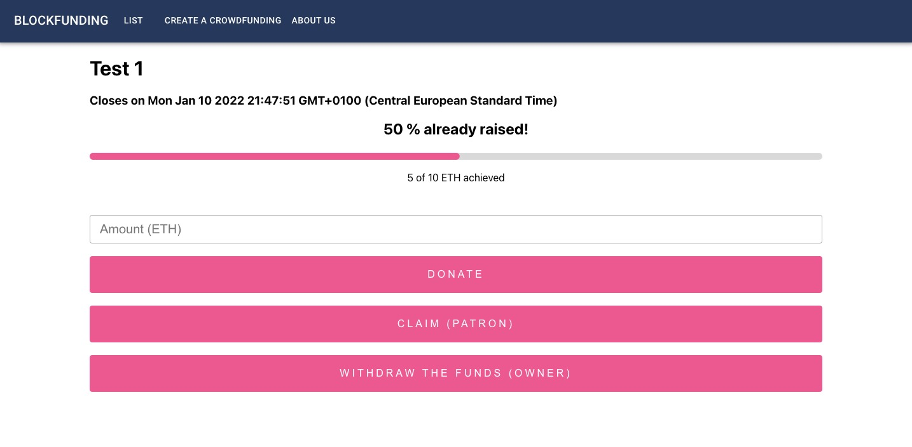
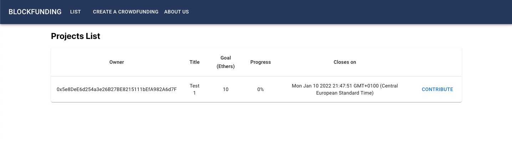

# Blockfunding

A blockchain based distributed crowdfunding platform. The goal of this project is to implement a decentralized crowdfunding platform that can be used to raise funds for any project.

This project is a proof of concept to learn the basics of blockchain technology and solidity development. The project is not intended to be a fully functional decentralized crowdfunding platform.

Contributors:
* [@gerardcastell](https://github.com/gerardcastell)
* [@martiriera](https://github.com/martiriera)
* [@sergio-gimenez](https://github.com/sergio-gimenez)





## The BFD token

The economy of the platform is based on a token called BFD. The token is a digital asset that can be used to donate/receive funds. This token is based on the ERC20 standard.

Since the project is a proof of concept, the token has been deployed in the ropsten testnet with a total supply of 100,000,000 $BFD. [$BFD in the explorer](https://ropsten.etherscan.io/token/0x05e01dDe3f37ac242B4Be9E52642bc811A79F17f).

## The Crowdfunding smart contract logic

All the logic of the crowdfunding is deployed in the [Crowdfunding](smart-contract/CrowdFunding.sol) smart contract (refer to the widely-commented source file to understand the logic). This contract is also deployed in the rospten testnet. [See the Crowdfunding smart contract in the explorer](https://ropsten.etherscan.io/address/0x33099805e7dfA8050E908BC42eCbfCb902DfD32b).

## Deployment

Install dependencies by running:

```source
npm install
```

Note:
`npm` was requiring sudo permissions to install packages and throwing errors all the time. I did the following steps to make it work:

* [Completely uninstall node from the system](https://stackoverflow.com/questions/32426601/how-can-i-completely-uninstall-nodejs-npm-and-node-in-ubuntu) (this link was the only that truly completely removed node and npm from the system)

* Install `node` **using [`nvm`](https://linuxize.com/post/how-to-install-node-js-on-ubuntu-20-04/)**. I installed the last LTS version of node.

Then run the following commands to deploy the contracts:

```source
npm run run:all
```

This will compile the `Crowdfunding.sol` file and deploy the smart contract to the ganache blockchain when it is already up and working. Finally it sets up the front-end server.
